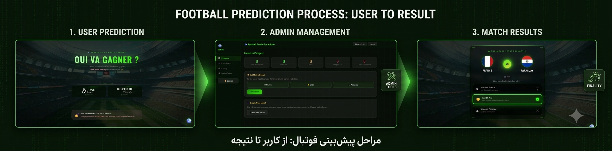
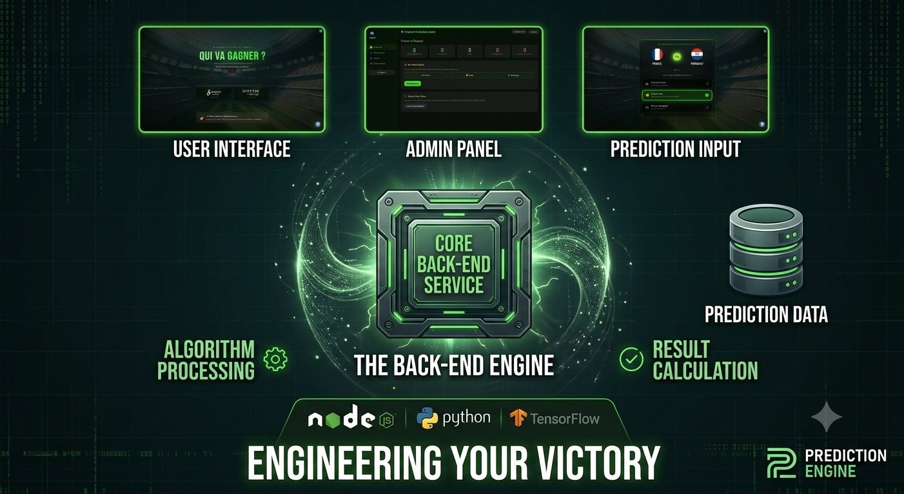

<div align="center">



# ⚽ Match Prediction System

### 🏆 پیش‌بینی مسابقات فوتبال – برنده ۵۰€ شوید

[](LICENSE)
[](https://php.net)
[](https://mysql.com)
[](http://makeapullrequest.com)
[](https://github.com/mohsenahanj/football-prediction/stargazers)

---

### 🌍 زبان / Language / Langue

[🇮🇷 فارسی](#persian) | [🇬🇧 English](#english) | [🇫🇷 Français](#francais)

</div>

---

<a id="persian"></a>

# 🇮🇷 فارسی

## 📑 فهرست مطالب

- [معرفی پروژه](#introduction)
- [امکانات](#features)
- [پیش‌نیازها](#prerequisites)
- [نصب و راه‌اندازی](#installation)
- [ساختار پروژه](#structure)
- [تنظیمات دیتابیس](#database)
- [نمای پنل ادمین](#admin-panel)
- [امنیت](#security)
- [فناوری‌های استفاده‌شده](#technologies)
- [مشارکت](#contributing)
- [لایسنس](#license)
- [سازنده](#author)

---

<a id="introduction"></a>

## 🎯 معرفی پروژه

این پروژه یک **سیستم کامل پیش‌بینی مسابقات فوتبال** مبتنی بر **PHP** و **MySQL** است.

کاربران می‌توانند نتیجه مسابقه را پیش‌بینی کنند و پس از ثبت نتیجه واقعی، از میان افرادی که پیش‌بینی صحیح داشته‌اند، به صورت تصادفی یک برنده انتخاب می‌شود.

> 💡 **جایزه:** برنده قرعه‌کشی **۵۰ یورو** دریافت می‌کند.

---

<a id="features"></a>

## ✨ امکانات

| ویژگی | توضیحات |
|--------|---------|
| 👥 ثبت‌نام کاربران | کاربران می‌توانند پیش‌بینی خود را ثبت کنند |
| 📊 شمارش پیش‌بینی‌ها | نمایش تعداد پیش‌بینی برای هر نتیجه |
| 🔐 پنل ادمین امن | تعیین نتیجه واقعی مسابقه |
| 🎲 قرعه‌کشی خودکار | انتخاب تصادفی برنده از بین پیش‌بینی‌های صحیح |
| ➕ ساخت مسابقه جدید | ایجاد و آرشیو مسابقات |
| 🏳️ مدیریت تیم‌ها | تغییر نام تیم‌ها و پرچم‌ها |
| 📤 خروجی CSV | دانلود نتایج به فرمت CSV |
| 🛡️ امنیت CSRF | محافظت در برابر حملات CSRF |
| 🔒 سشن امن | مدیریت نشست‌ها با SameSite=Strict |
| 🗄️ اتصال PDO | اتصال ایمن به دیتابیس MySQL |

---

<a id="prerequisites"></a>

## ⚙️ پیش‌نیازها

قبل از نصب، مطمئن شوید که موارد زیر را دارید:

- PHP >= 7.4
- MySQL >= 5.7 یا MariaDB >= 10.3
- Apache یا Nginx
- PDO Extension
- OpenSSL Extension

---

<a id="installation"></a>

## 📦 نصب و راه‌اندازی

### 1️⃣ کلون کردن پروژه

```bash
git clone https://github.com/mohsenahanj/football-prediction.git
cd football-prediction
```

### 2️⃣ ایجاد دیتابیس

```sql
CREATE DATABASE football_prediction
CHARACTER SET utf8mb4
COLLATE utf8mb4_unicode_ci;
```

### 3️⃣ ایمپورت دیتابیس

```bash
mysql -u root -p football_prediction < database.sql
```

### 4️⃣ تنظیم فایل پیکربندی

فایل `config.php` را ویرایش کنید:

```php
define('DB_HOST', 'localhost');
define('DB_NAME', 'football_prediction');
define('DB_USER', 'root');
define('DB_PASS', 'your_password');
```

### 5️⃣ اجرای پروژه

در مرورگر باز کنید:

```text
http://localhost/football-prediction
```

---

<a id="structure"></a>

## 📁 ساختار پروژه

```text
football-prediction/
│
├── admin/
├── assets/
├── includes/
├── uploads/
├── config.php
├── database.sql
├── index.php
├── prediction.php
├── winner.php
└── README.md
```

---

<a id="database"></a>

### ۲. تنظیمات دیتابیس

فایل `config.php` را باز کرده و اطلاعات دیتابیس خود را وارد کنید:

```php
define('DB_HOST', 'localhost');
define('DB_NAME', 'football_prediction');
define('DB_USER', 'root');
define('DB_PASS', '');
define('DB_CHARSET', 'utf8mb4');
```

### ۳. ساخت دیتابیس

```sql
CREATE DATABASE football_prediction CHARACTER SET utf8mb4 COLLATE utf8mb4_persian_ci;
```

### ۴. تنظیم ادمین

```php
define('ADMIN_USER', 'admin');
define('ADMIN_PASS_HASH', password_hash('YOUR_SECURE_PASSWORD', PASSWORD_BCRYPT));
```

### ۵. مجوزهای پوشه

```bash
chmod -R 755 assets/uploads/
```

### ۶. اجرای پروژه

پروژه را در سرور محلی (XAMPP, WAMP, Laragon) یا هاست خود قرار دهید و از طریق مرورگر باز کنید.

---

<a id="structure"></a>
## 🛠 ساختار پروژه

```plaintext
football-prediction/
│
├── admin/                  # پنل مدیریت
│   ├── index.php           # صفحه ورود ادمین
│   ├── dashboard.php       # داشبورد ادمین
│   ├── lottery.php         # صفحه قرعه‌کشی
│   └── settings.php        # تنظیمات
│
├── assets/                 # فایل‌های استاتیک
│   ├── uploads/            # تصاویر آپلود شده
│   ├── header.png          # بنر هدر
│   └── admin-preview.png   # پیش‌نمایش پنل ادمین
│
├── config/                 # فایل‌های پیکربندی
│   └── config.php          # تنظیمات اصلی
│
├── css/                    # فایل‌های استایل
│   └── style.css
│
├── js/                     # فایل‌های جاوااسکریپت
│   └── app.js
│
├── includes/               # فایل‌های مشترک
│   ├── db.php              # اتصال دیتابیس
│   ├── functions.php       # توابع کمکی
│   └── csrf.php            # محافظت CSRF
│
├── index.php               # صفحه اصلی
├── predict.php             # صفحه ثبت پیش‌بینی
├── results.php             # صفحه نتایج
├── database.sql            # اسکریپت ساخت جداول
├── README.md               # فایل راهنما
└── LICENSE                 # فایل لایسنس
```

---

<a id="database"></a>
## 🗄 تنظیمات دیتابیس

### جداول اصلی

| جدول | توضیحات |
|------|---------|
| `matches` | اطلاعات مسابقات |
| `teams` | اطلاعات تیم‌ها |
| `predictions` | پیش‌بینی‌های کاربران |
| `users` | اطلاعات کاربران |
| `winners` | برندگان قرعه‌کشی |

### نمونه اسکریپت SQL

```sql
CREATE TABLE matches (
    id INT AUTO_INCREMENT PRIMARY KEY,
    team_home VARCHAR(100) NOT NULL,
    team_away VARCHAR(100) NOT NULL,
    match_date DATETIME NOT NULL,
    score_home INT DEFAULT NULL,
    score_away INT DEFAULT NULL,
    status ENUM('pending', 'finished') DEFAULT 'pending',
    created_at TIMESTAMP DEFAULT CURRENT_TIMESTAMP
);

CREATE TABLE predictions (
    id INT AUTO_INCREMENT PRIMARY KEY,
    match_id INT NOT NULL,
    user_name VARCHAR(100) NOT NULL,
    prediction ENUM('home', 'draw', 'away') NOT NULL,
    created_at TIMESTAMP DEFAULT CURRENT_TIMESTAMP,
    FOREIGN KEY (match_id) REFERENCES matches(id) ON DELETE CASCADE
);
```

---

<a id="admin-panel"></a>
## 🖥 نمای پنل ادمین

<div align="center">
    
    <br>
    <em>پیش‌نمایش داشبورد مدیریت</em>
</div>

---

<a id="security"></a>


## 🔐 امنیت

| لایه امنیتی | توضیحات |
|-------------|---------|
| 🔑 CSRF Token | توکن با عمر محدود برای هر فرم |
| 📁 محدودیت آپلود | فقط تصاویر (MIME: jpg, png, gif, webp) |
| 📏 حداکثر حجم فایل | ۲ مگابایت |
| 🔒 سشن امن | `SameSite=Strict`, `HttpOnly`, `Secure` |
| 🛡️ رمزنگاری رمز عبور | `PASSWORD_BCRYPT` |
| 💉 محافظت SQL Injection | استفاده از PDO Prepared Statements |

### تنظیمات config.php

```php
// امنیت CSRF
define('CSRF_TOKEN_LIFETIME', 3600);

// محدودیت آپلود
define('MAX_UPLOAD_SIZE', 2 * 1024 * 1024); // 2MB
define('ALLOWED_MIME', ['image/jpeg', 'image/png', 'image/gif', 'image/webp']);

// سشن امن
session_set_cookie_params([
    'lifetime' => 3600,
    'path' => '/',
    'domain' => '',
    'secure' => true,
    'httponly' => true,
    'samesite' => 'Strict'
]);

// اتصال دیتابیس
$pdo = new PDO(
    "mysql:host=" . DB_HOST . ";dbname=" . DB_NAME . ";charset=" . DB_CHARSET,
    DB_USER,
    DB_PASS,
    [
        PDO::ATTR_ERRMODE => PDO::ERRMODE_EXCEPTION,
        PDO::ATTR_DEFAULT_FETCH_MODE => PDO::FETCH_ASSOC,
        PDO::ATTR_EMULATE_PREPARES => false,
    ]
);
```

---

<a id="technologies"></a>
## 🧰 فناوری‌های استفاده‌شده

| Frontend | Backend | Database | Server |
|----------|---------|----------|--------|
| HTML5 | PHP 7.4+ | MySQL 8.0+ | Apache/Nginx |
| CSS3 | PDO | MariaDB | XAMPP/Laragon |
| JavaScript | Sessions | | |
| Bootstrap 5 | CSRF Protection | | |

---

<a id="contributing"></a>
## 🤝 مشارکت

مشارکت شما باعث خوشحالی ماست! 🎉

1. پروژه را **Fork** کنید
2. یک Branch جدید بسازید: `git checkout -b feature/my-feature`
3. تغییرات را **Commit** کنید: `git commit -m 'Add some feature'`
4. به Branch اصلی **Push** کنید: `git push origin feature/my-feature`
5. یک **Pull Request** ارسال کنید

---

<a id="license"></a>
## 📝 لایسنس

این پروژه تحت لایسنس **MIT** منتشر شده است.  
جزئیات بیشتر در فایل [LICENSE](LICENSE).

---

<a id="author"></a>
## 👨‍💻 سازنده

<div align="center">

### Mohsen Ahanj

**CEO & Founder of [RythmeVie](https://rythmevie.com)**

[](https://github.com/mohsenahanj)
[](https://www.reddit.com/user/Accurate_Effort_9775/)

</div>

---

<div align="center">

### ⭐ اگر این پروژه برایتان مفید بود، لطفاً یک ستاره بدهید! ⭐

</div>

---
---

<a id="english"></a>
# 🇬🇧 English

## 📑 Table of Contents

- [Overview](#overview-en)
- [Features](#features-en)
- [Prerequisites](#prerequisites-en)
- [Installation](#installation-en)
- [Project Structure](#structure-en)
- [Database Setup](#database-en)
- [Admin Panel Preview](#admin-panel-en)
- [Security](#security-en)
- [Technologies Used](#technologies-en)
- [Contributing](#contributing-en)
- [License](#license-en)
- [Author](#author-en)

---

<a id="overview-en"></a>
## 🎯 Overview

This project is a complete **Football Match Prediction System** built with PHP and MySQL. Users can predict match outcomes, and after the real result is announced, a lottery is held among those who predicted correctly.

> 💡 **Prize:** The lottery winner receives **€50**!

---

<a id="features-en"></a>
## ✨ Features

| Feature | Description |
|---------|-------------|
| 👥 User Registration | Users can submit their predictions |
| 📊 Prediction Counter | Shows prediction count for each outcome |
| 🔐 Secure Admin Panel | Set the real match result |
| 🎲 Auto Lottery | Random winner selection from correct predictions |
| ➕ Create Matches | Create and archive matches |
| 🏳️ Team Management | Change team names and flags |
| 📤 CSV Export | Download results in CSV format |
| 🛡️ CSRF Protection | Protection against CSRF attacks |
| 🔒 Secure Sessions | Session management with SameSite Strict |
| 🗄️ PDO Connection | Secure MySQL database connection |

---

<a id="prerequisites-en"></a>
## ⚙️ Prerequisites

Before installation, make sure you have:

- ✅ **PHP** >= 7.4
- ✅ **MySQL** >= 5.7 or **MariaDB** >= 10.3
- ✅ **Apache** or **Nginx** with `mod_rewrite` support
- ✅ **PDO Extension** enabled in PHP
- ✅ **OpenSSL Extension** (for encryption)

---

<a id="installation-en"></a>
## 📦 Installation

### 1. Clone the project

```bash
git clone https://github.com/mohsenahanj/football-prediction.git
cd football-prediction
```

### 2. Database configuration

Open `config.php` and enter your database credentials:

```php
define('DB_HOST', 'localhost');
define('DB_NAME', 'football_prediction');
define('DB_USER', 'root');
define('DB_PASS', '');
define('DB_CHARSET', 'utf8mb4');
```

### 3. Create database

```sql
CREATE DATABASE football_prediction CHARACTER SET utf8mb4 COLLATE utf8mb4_general_ci;
```

### 4. Admin setup

```php
define('ADMIN_USER', 'admin');
define('ADMIN_PASS_HASH', password_hash('YOUR_SECURE_PASSWORD', PASSWORD_BCRYPT));
```

### 5. Folder permissions

```bash
chmod -R 755 assets/uploads/
```

### 6. Run the project

Place the project on your local server (XAMPP, WAMP, Laragon) or hosting and open it in your browser.

---

<a id="structure-en"></a>
## 🛠 Project Structure

```plaintext
football-prediction/
│
├── admin/                  # Admin panel
│   ├── index.php           # Admin login page
│   ├── dashboard.php       # Admin dashboard
│   ├── lottery.php         # Lottery page
│   └── settings.php        # Settings
│
├── assets/                 # Static files
│   ├── uploads/            # Uploaded images
│   ├── header.png          # Header banner
│   └── admin-preview.png   # Admin panel preview
│
├── config/                 # Configuration files
│   └── config.php          # Main settings
│
├── css/                    # Style files
│   └── style.css
│
├── js/                     # JavaScript files
│   └── app.js
│
├── includes/               # Shared files
│   ├── db.php              # Database connection
│   ├── functions.php       # Helper functions
│   └── csrf.php            # CSRF protection
│
├── index.php               # Main page
├── predict.php             # Prediction page
├── results.php             # Results page
├── database.sql            # Table creation script
├── README.md               # Documentation
└── LICENSE                 # License file
```

---

<a id="database-en"></a>
## 🗄 Database Setup

### Main Tables

| Table | Description |
|-------|-------------|
| `matches` | Match information |
| `teams` | Team information |
| `predictions` | User predictions |
| `users` | User information |
| `winners` | Lottery winners |

### Sample SQL Script

```sql
CREATE TABLE matches (
    id INT AUTO_INCREMENT PRIMARY KEY,
    team_home VARCHAR(100) NOT NULL,
    team_away VARCHAR(100) NOT NULL,
    match_date DATETIME NOT NULL,
    score_home INT DEFAULT NULL,
    score_away INT DEFAULT NULL,
    status ENUM('pending', 'finished') DEFAULT 'pending',
    created_at TIMESTAMP DEFAULT CURRENT_TIMESTAMP
);

CREATE TABLE predictions (
    id INT AUTO_INCREMENT PRIMARY KEY,
    match_id INT NOT NULL,
    user_name VARCHAR(100) NOT NULL,
    prediction ENUM('home', 'draw', 'away') NOT NULL,
    created_at TIMESTAMP DEFAULT CURRENT_TIMESTAMP,
    FOREIGN KEY (match_id) REFERENCES matches(id) ON DELETE CASCADE
);
```

---

<a id="admin-panel-en"></a>
## 🖥 Admin Panel Preview

<div align="center">
    
    <br>
    <em>Admin Dashboard Preview</em>
</div>

---

<a id="security-en"></a>
## 🔐 Security

| Security Layer | Description |
|----------------|-------------|
| 🔑 CSRF Token | Time-limited token for each form |
| 📁 Upload Restriction | Images only (MIME: jpg, png, gif, webp) |
| 📏 Max File Size | 2 MB |
| 🔒 Secure Session | `SameSite=Strict`, `HttpOnly`, `Secure` |
| 🛡️ Password Encryption | `PASSWORD_BCRYPT` |
| 💉 SQL Injection Protection | PDO Prepared Statements |

---

<a id="technologies-en"></a>
## 🧰 Technologies Used

| Frontend | Backend | Database | Server |
|----------|---------|----------|--------|
| HTML5 | PHP 7.4+ | MySQL 8.0+ | Apache/Nginx |
| CSS3 | PDO | MariaDB | XAMPP/Laragon |
| JavaScript | Sessions | | |
| Bootstrap 5 | CSRF Protection | | |

---

<a id="contributing-en"></a>
## 🤝 Contributing

Contributions are welcome! 🎉

1. **Fork** the project
2. Create a new branch: `git checkout -b feature/my-feature`
3. **Commit** your changes: `git commit -m 'Add some feature'`
4. **Push** to the branch: `git push origin feature/my-feature`
5. Open a **Pull Request**

---

<a id="license-en"></a>
## 📝 License

This project is licensed under the **MIT License**.  
See the [LICENSE](LICENSE) file for details.

---

<a id="author-en"></a>
## 👨‍💻 Author

<div align="center">

### Mohsen Ahanj

**CEO & Founder of [RythmeVie](https://rythmevie.com)**

[](https://github.com/mohsenahanj)
[](https://www.reddit.com/user/Accurate_Effort_9775/)

</div>

---

<div align="center">

### ⭐ If this project was helpful, please give it a star! ⭐

</div>

---
---

<a id="francais"></a>
# 🇫🇷 Français

## 📑 Table des matières

- [Présentation](#presentation-fr)
- [Fonctionnalités](#features-fr)
- [Prérequis](#prerequisites-fr)
- [Installation](#installation-fr)
- [Structure du projet](#structure-fr)
- [Configuration de la base de données](#database-fr)
- [Aperçu du panneau admin](#admin-panel-fr)
- [Sécurité](#security-fr)
- [Technologies utilisées](#technologies-fr)
- [Contribution](#contributing-fr)
- [Licence](#license-fr)
- [Auteur](#author-fr)

---

<a id="presentation-fr"></a>
## 🎯 Présentation

Ce projet est un **système complet de prédiction de matchs de football** basé sur PHP et MySQL. Les utilisateurs peuvent prédire les résultats des matchs, et après l'annonce du résultat réel, un tirage au sort est effectué parmi ceux qui ont correctement prédit.

> 💡 **Prix :** Le gagnant du tirage au sort reçoit **50 €** !

---

<a id="features-fr"></a>
## ✨ Fonctionnalités

| Fonctionnalité | Description |
|----------------|-------------|
| 👥 Inscription des utilisateurs | Les utilisateurs peuvent soumettre leurs prédictions |
| 📊 Compteur de prédictions | Affiche le nombre de prédictions pour chaque résultat |
| 🔐 Panneau admin sécurisé | Définir le résultat réel du match |
| 🎲 Tirage au sort automatique | Sélection aléatoire du gagnant parmi les bonnes prédictions |
| ➕ Créer des matchs | Créer et archiver des matchs |
| 🏳️ Gestion des équipes | Modifier les noms et drapeaux des équipes |
| 📤 Export CSV | Télécharger les résultats au format CSV |
| 🛡️ Protection CSRF | Protection contre les attaques CSRF |
| 🔒 Sessions sécurisées | Gestion des sessions avec SameSite Strict |
| 🗄️ Connexion PDO | Connexion sécurisée à la base de données MySQL |

---

<a id="prerequisites-fr"></a>
## ⚙️ Prérequis

Avant l'installation, assurez-vous d'avoir :

- ✅ **PHP** >= 7.4
- ✅ **MySQL** >= 5.7 ou **MariaDB** >= 10.3
- ✅ **Apache** ou **Nginx** avec support `mod_rewrite`
- ✅ **Extension PDO** activée dans PHP
- ✅ **Extension OpenSSL** (pour le chiffrement)

---

<a id="installation-fr"></a>
## 📦 Installation

### 1. Cloner le projet

```bash
git clone https://github.com/mohsenahanj/football-prediction.git
cd football-prediction
```

### 2. Configuration de la base de données

Ouvrez `config.php` et entrez vos identifiants de base de données :

```php
define('DB_HOST', 'localhost');
define('DB_NAME', 'football_prediction');
define('DB_USER', 'root');
define('DB_PASS', '');
define('DB_CHARSET', 'utf8mb4');
```

### 3. Créer la base de données

```sql
CREATE DATABASE football_prediction CHARACTER SET utf8mb4 COLLATE utf8mb4_general_ci;
```

### 4. Configuration de l'admin

```php
define('ADMIN_USER', 'admin');
define('ADMIN_PASS_HASH', password_hash('YOUR_SECURE_PASSWORD', PASSWORD_BCRYPT));
```

### 5. Permissions des dossiers

```bash
chmod -R 755 assets/uploads/
```

### 6. Exécuter le projet

Placez le projet sur votre serveur local (XAMPP, WAMP, Laragon) ou hébergement et ouvrez-le dans votre navigateur.

---

<a id="structure-fr"></a>
## 🛠 Structure du projet

```plaintext
football-prediction/
│
├── admin/                  # Panneau d'administration
│   ├── index.php           # Page de connexion admin
│   ├── dashboard.php       # Tableau de bord admin
│   ├── lottery.php         # Page de tirage au sort
│   └── settings.php        # Paramètres
│
├── assets/                 # Fichiers statiques
│   ├── uploads/            # Images téléchargées
│   ├── header.png          # Bannière d'en-tête
│   └── admin-preview.png   # Aperçu du panneau admin
│
├── config/                 # Fichiers de configuration
│   └── config.php          # Paramètres principaux
│
├── css/                    # Fichiers de style
│   └── style.css
│
├── js/                     # Fichiers JavaScript
│   └── app.js
│
├── includes/               # Fichiers partagés
│   ├── db.php              # Connexion à la base de données
│   ├── functions.php       # Fonctions utilitaires
│   └── csrf.php            # Protection CSRF
│
├── index.php               # Page principale
├── predict.php             # Page de prédiction
├── results.php             # Page de résultats
├── database.sql            # Script de création des tables
├── README.md               # Documentation
└── LICENSE                 # Fichier de licence
```

---

<a id="database-fr"></a>
## 🗄 Configuration de la base de données

### Tables principales

| Table | Description |
|-------|-------------|
| `matches` | Informations sur les matchs |
| `teams` | Informations sur les équipes |
| `predictions` | Prédictions des utilisateurs |
| `users` | Informations des utilisateurs |
| `winners` | Gagnants du tirage au sort |

### Exemple de script SQL

```sql
CREATE TABLE matches (
    id INT AUTO_INCREMENT PRIMARY KEY,
    team_home VARCHAR(100) NOT NULL,
    team_away VARCHAR(100) NOT NULL,
    match_date DATETIME NOT NULL,
    score_home INT DEFAULT NULL,
    score_away INT DEFAULT NULL,
    status ENUM('pending', 'finished') DEFAULT 'pending',
    created_at TIMESTAMP DEFAULT CURRENT_TIMESTAMP
);

CREATE TABLE predictions (
    id INT AUTO_INCREMENT PRIMARY KEY,
    match_id INT NOT NULL,
    user_name VARCHAR(100) NOT NULL,
    prediction ENUM('home', 'draw', 'away') NOT NULL,
    created_at TIMESTAMP DEFAULT CURRENT_TIMESTAMP,
    FOREIGN KEY (match_id) REFERENCES matches(id) ON DELETE CASCADE
);
```

---

<a id="admin-panel-fr"></a>
## 🖥 Aperçu du panneau admin

<div align="center">
    
    <br>
    <em>Aperçu du tableau de bord admin</em>
</div>

---

<a id="security-fr"></a>
## 🔐 Sécurité

| Couche de sécurité | Description |
|--------------------|-------------|
| 🔑 Token CSRF | Token à durée limitée pour chaque formulaire |
| 📁 Restriction de téléchargement | Images uniquement (MIME : jpg, png, gif, webp) |
| 📏 Taille max du fichier | 2 Mo |
| 🔒 Session sécurisée | `SameSite=Strict`, `HttpOnly`, `Secure` |
| 🛡️ Chiffrement du mot de passe | `PASSWORD_BCRYPT` |
| 💉 Protection contre injection SQL | PDO Prepared Statements |

---

<a id="technologies-fr"></a>
## 🧰 Technologies utilisées

| Frontend | Backend | Base de données | Serveur |
|----------|---------|-----------------|---------|
| HTML5 | PHP 7.4+ | MySQL 8.0+ | Apache/Nginx |
| CSS3 | PDO | MariaDB | XAMPP/Laragon |
| JavaScript | Sessions | | |
| Bootstrap 5 | Protection CSRF | | |

---

<a id="contributing-fr"></a>
## 🤝 Contribution

Les contributions sont les bienvenues ! 🎉

1. **Forkez** le projet
2. Créez une nouvelle branche : `git checkout -b feature/ma-fonctionnalite`
3. **Commitez** vos modifications : `git commit -m 'Ajouter une fonctionnalité'`
4. **Pushez** vers la branche : `git push origin feature/ma-fonctionnalite`
5. Ouvrez une **Pull Request**

---

<a id="license-fr"></a>
## 📝 Licence

Ce projet est sous licence **MIT**.  
Voir le fichier [LICENSE](LICENSE) pour plus de détails.

---

<a id="author-fr"></a>
## 👨‍💻 Auteur

<div align="center">

### Mohsen Ahanj

**CEO & Fondateur de [RythmeVie](https://rythmevie.com)**

[](https://github.com/mohsenahanj)
[](https://www.reddit.com/user/Accurate_Effort_9775/)

</div>

---

<div align="center">

### ⭐ Si ce projet vous a été utile, merci de lui donner une étoile ! ⭐

</div>
